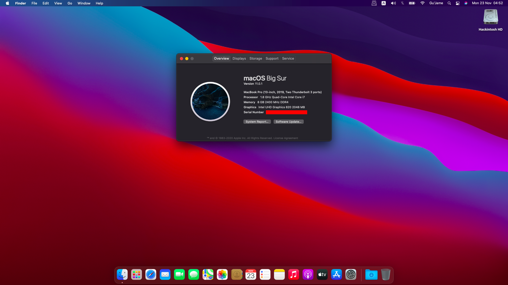

# Lenovo Ideapad 530S-14IKB (Catalina and Big Sur)

Please generate SMBIOS !!!

### 🔍 Specifications

| Specifications | Detail                  |
| -------------- | ----------------------- |
| Processor      | Intel® i5 8250U         |
| Memory         | 8 GB DDR4 2400 MHz      |
| HDD            | 250 GB SSD M.2 PCI-E    |
| Graphics Card  | Intel® UHD Graphics 620 |
| Display        | 14.0" FHD IPS AG 250N   |
| WIFI           | DW1560 (BCM94352Z)      |

### ℹ️ What works and what doesn't

| Feature                 | Status |
| ----------------------- | ------ |
| Intel iGPU              | ✅     |
| Trackpad                | ✅     |
| Speakers and Headphones | ✅     |
| Built-in Microphone     | ✅     |
| Webcam                  | ✅     |
| Wi-Fi/BT                | ✅     |
| HDMI Port               | ✅     |
| SD Card Reader          | ✅     |
| Shutdown and Restart    | ✅     |
| Sleep and Wake          | ✅     |
| Nvidia GPU              | ❌     |
| Fingerprint reader      | ❌     |

### 🔋 Power management configuration

Hibernation is not supported on a Hackintosh and everything related to it should be completely disabled. After every update, these settings should be reapplied manually.

```
sudo pmset -a hibernatemode 0
sudo rm -f /var/vm/sleepimage
sudo mkdir /var/vm/sleepimage
sudo pmset -a standby 0
sudo pmset -a autopoweroff 0
sudo pmset -a powernap 0
sudo pmset -a proximitywake 0
sudo pmset -b tcpkeepalive 0 (optional)
```
